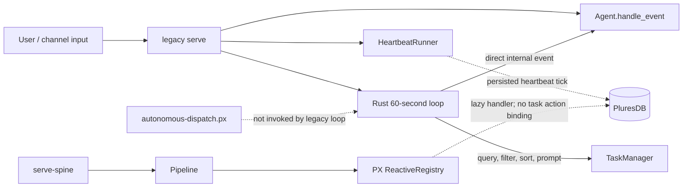
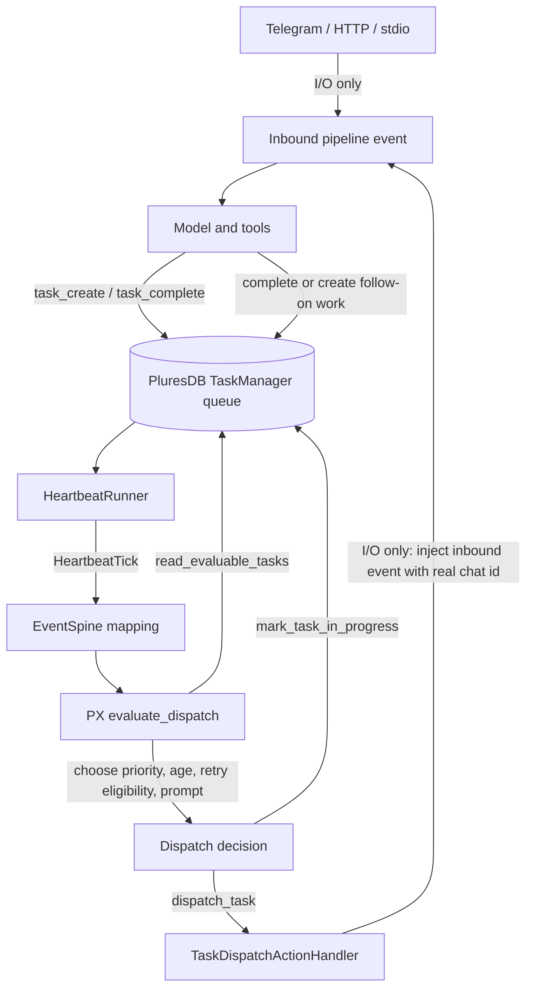

# Autonomous orchestration architecture

## Decision

`serve-spine` is the autonomous runtime.  It treats PluresDB as the durable
source of truth and PX procedures as the place where task selection, ordering,
retry eligibility, and dispatch decisions are made.  Rust channel adapters and
action handlers only bridge I/O: receive a message, read or update durable
task state, and inject a selected task back into the pipeline.

The legacy `serve` command remains a compatibility runtime for its larger
Telegram feature surface.  Its imperative dispatcher is not an autonomous
orchestration implementation and must not be used to validate PX scheduling.
New autonomous deployments should use `agens-host serve-spine --channel telegram`,
`agens-host serve-spine --channel http`, or `agens-host serve-spine --channel stdio`.

## As built before this change

The system had two schedulers.  The one actually running task selection was a
Rust loop with process-local cooldown tracking.  The PX graph was loaded on a
separate path but had neither a live `TaskDispatchActionHandler` nor a
pipeline injector.  A restart therefore lost dispatch timing, and dispatches
could not durably claim a task before giving it to an agent.

## Problems that inhibit autonomous execution

| Problem | Consequence |
| --- | --- |
| Two independent runtime paths | The legacy loop bypasses PX decisions; channel behavior differs. |
| Process-local cooldown and no durable claim | Restarts replay work; concurrent runners can select the same task. |
| PX action handler was lazy/unwired | `read_evaluable_tasks`, `mark_task_in_progress`, and `dispatch_task` could not complete the decision-to-execution path. |
| Direct `Agent.handle_event` dispatch | Task work does not re-enter the same pipeline or preserve the originating chat route. |
| Flat model task API | `TaskManager` supports `parent_task` and `subtasks`, but the model-facing registry exposes only `task_create`; it cannot create a durable child edge. |
| Completion is not a fan-in gate | A parent can be completed without first proving all subtasks are terminal/satisfied. |

## Fixed architecture

`autonomous-dispatch.px` is now the authoritative decision graph.  A
heartbeat emits `HeartbeatTick`; the spine maps it to `evaluate_dispatch`; PX
reads durable candidates, applies priority/age/retry rules, builds a prompt,
then invokes narrow actions to claim and inject the selected task.  The
injected event follows the ordinary pipeline, so replies retain the task's
real chat route rather than being stranded in an internal turn.

## Implemented changes

- Upgraded the radix runtime to `v1.55.60`, which supplies the heartbeat spine
  mapping and the task-dispatch action seam.
- Bound `TaskDispatchActionHandler` to the live pipeline emitter and shared
  `TaskManager` in `run_serve_spine`.
- Replaced direct PX state writes with `read_evaluable_tasks`,
  `mark_task_in_progress`, and `dispatch_task` actions.
- Started the same heartbeat-to-pipeline flow for `stdio` and `http`; Telegram
  already used it.

## Child tasks and completion fan-in

`serve-spine` now exposes `task_create_subtask(parent_task_id, description,
completion_conditions)`, backed by `TaskManager::create_subtask`. The local
task-graph boundary also returns the durable parent/child graph to PX and
rejects a `task_complete` request for a parent that has non-terminal children.
PX uses that graph as follows:

1. create children under the active parent;
2. make only unblocked leaf tasks evaluable;
3. on a child terminal event, evaluate the parent fan-in;
4. complete the parent only when every child is terminal and its own
   completion conditions hold.

The wrapper deliberately delegates persistence to the existing upstream
`TaskManager`; it does not duplicate the task schema. Its narrow surface is a
bridge until `pares-radix` promotes the same operations into
`TaskRegistryTool`.

## Development-guide update

The development guide's orchestration guidance should retain its PX-first
principle but add an executable acceptance criterion: a task must survive a
restart, be selected by PX after a heartbeat, be durably claimed before its
agent event is emitted, route its result to the original chat, and prevent a
parent from closing while one of its children is non-terminal.
